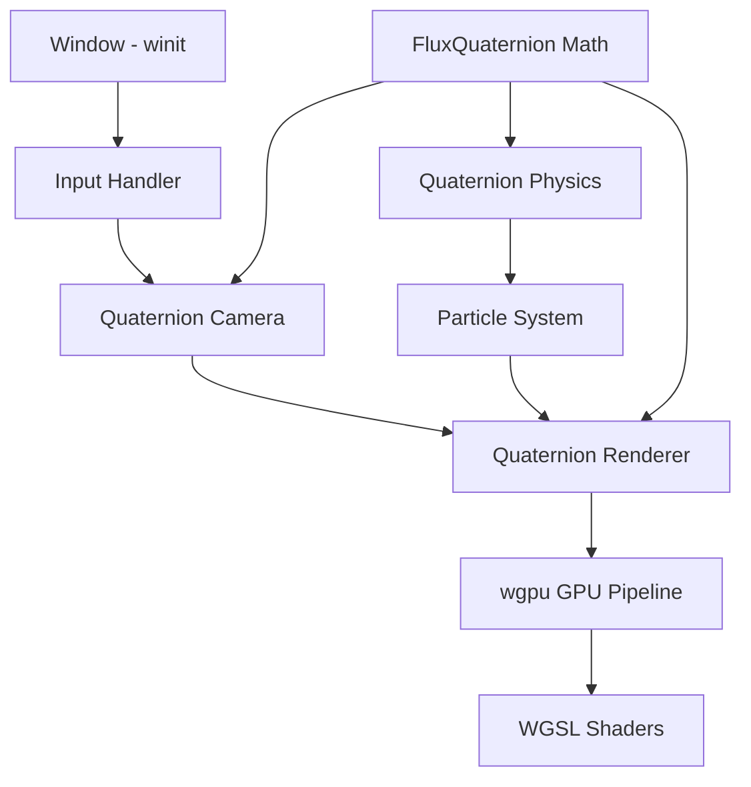

# Custom Quaternion 3D Engine — Architecture Plan

## Goal
Build a custom 3D engine from scratch using **pure quaternion math** (no matrix transforms, no Bevy) to render a life-like hurricane you can fly through. This proves the vortex theory: quaternions are a more efficient and natural way to represent reality.

## Core Principle
**Everything is a quaternion.** Positions, rotations, velocities, forces, light, camera — all represented as `FluxQuaternion` operations. No 4x4 matrices anywhere in the pipeline except the final GPU projection (which WGSL/Vulkan requires).

---

## Architecture



## Tech Stack

| Layer | Library | Purpose |
|-------|---------|---------|
| Window | `winit` | OS window + input events |
| GPU | `wgpu` | Vulkan/DX12/Metal rendering |
| Shaders | WGSL | Compute + render shaders |
| Math | `FluxQuaternion` | Our custom quaternion math - NO external math lib |
| Random | `rand` | Particle initialization |

## Module Structure

```
src/
  engine/
    mod.rs              -- Engine core: window, event loop, frame timing
    window.rs           -- winit window creation
    input.rs            -- Keyboard/mouse input state
    gpu.rs              -- wgpu device, queue, surface setup
  
  quaternion/
    mod.rs              -- Re-export
    math.rs             -- FluxQuaternion: Hamilton product, conjugate, norm, normalize, interact
    camera.rs           -- Quaternion-based fly camera: position as pure quaternion, orientation as unit quaternion
    transform.rs        -- Quaternion-to-projection conversion for GPU (the ONLY place we touch matrices)
  
  renderer/
    mod.rs              -- Render pipeline orchestration
    particle_pipeline.rs -- GPU render pipeline for point sprites
    compute_pipeline.rs  -- GPU compute pipeline for quaternion field simulation
    shaders/
      particle.wgsl     -- Vertex/fragment shader for particles
      hurricane.wgsl    -- Compute shader for hurricane physics on GPU
  
  simulation/
    mod.rs              -- Simulation orchestration
    hurricane.rs        -- Hurricane particle system using FluxQuaternion
    
  main.rs              -- Entry point: create engine, run loop
```

## Key Design Decisions

### 1. Camera — Pure Quaternion
- **Position**: stored as `Vec3` (extracted from quaternion for GPU)
- **Orientation**: stored as unit `FluxQuaternion` — no Euler angles, no rotation matrices
- **Movement**: WASD moves along quaternion-rotated forward/right vectors
- **Look**: mouse delta creates small rotation quaternions, multiplied into orientation
- **Advantage over matrices**: no gimbal lock, 4 floats instead of 16, single multiply for rotation

### 2. Renderer — Point Sprites
- Each hurricane particle = 1 point sprite
- GPU compute shader updates particle positions using quaternion physics
- GPU render shader draws particles as camera-facing quads
- Color = function of quaternion energy density (norm)
- Size = function of distance from eye-wall

### 3. Physics — Quaternion Field on GPU
- 30,000+ particles, each with a `FluxQuaternion` state
- GPU compute shader runs the vortex field theory:
  - Pressure gradient as quaternion wave
  - Coriolis effect as quaternion rotation
  - Drag as quaternion damping
  - Wave interaction via Hamilton product
- All physics runs on GPU — CPU just handles input and frame timing

### 4. Lighting — Wave Interference
- No traditional lighting model (Phong, PBR)
- Light = quaternion wave emitted from a source
- Color = interference pattern of overlapping waves
- This is the ultimate proof of the theory: light itself is a quaternion wave

### 5. The Only Matrix
- The view-projection matrix for the GPU vertex shader
- Built FROM quaternion camera state: `quat_to_view_matrix(orientation, position)`
- This is the single bridge between quaternion world and GPU clip space

## Hurricane Physics (3D)

The hurricane is a 3D vortex with:
- **Horizontal plane**: spiral wind bands (same as 2D but in 3D space)
- **Vertical structure**: updrafts in eye-wall, downdrafts in eye, rain bands at altitude
- **Cloud layers**: particles at different heights with different opacities
- **Eye**: clear column you can fly down into
- **Eye-wall**: towering wall of dense particles (highest energy)

## Implementation Order

1. Window + GPU setup (winit + wgpu)
2. Quaternion camera with fly controls
3. Basic particle renderer (point sprites)
4. Hurricane particle system (CPU first)
5. GPU compute shader for hurricane physics
6. Quaternion-based lighting
7. Polish: cloud density, rain, eye detail

## Why Not Bevy?

Bevy uses traditional matrix-based transforms internally. By building from scratch with `winit` + `wgpu`, we can prove that the ENTIRE pipeline — from input to physics to rendering — can be driven by quaternion math, with matrices only appearing at the final GPU projection step. This is the strongest possible proof of the vortex theory.
